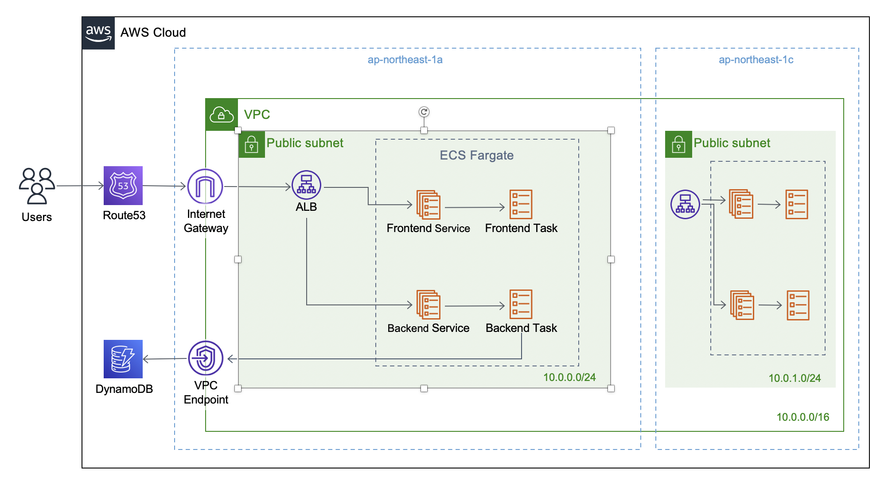

# オセロAI対局サービスの提案アーキテクチャ

# はじめに
本提案では以下の設計には触れない。

* フロントエンドサーバーのアーキテクチャ
* バックエンドサーバーのアーキテクチャ
* データベースのスキーマ

# アーキテクチャ概要
本案で提案するシステム構成を下図に示す。

詳細な検討は後述するが、概略は以下の通り。
* AWSを用いる。
* VPCをマルチAZ構成で作成し、耐障害性を高める。
* フロントエンド/バックエンドサーバーはコンテナイメージとしてECRに保存する。
* ECRのイメージをECS Serviceとしてデプロイする。システム障害時の自動復旧が自動で行われ、スケールアウトが容易に行える。
* サーバーをパブリックサブネットに配置することで、NAT Gatewayが不要になり、コストを削減できる。

## ネットワーク構成

マルチAZ構成をとることで、可用性、耐障害性を高める。

### Route53とALBを用いたルーティング
Route53を用いて、各AZのALBにリクエストを振り分ける。

### ヘルスチェック
ALBのもつヘルスチェック機能を用いて、サーバーの死活監視を行う。
障害発生時のルーティングと復旧までの流れは以下のとおり。

1. サーバーが何らかの理由でヘルスチェックに失敗する
2. ECS Serviceがアンヘルシーなタスクの停止と新規タスクの立ち上げを始める
3. ALBがアンヘルシーなサーバを検知する
4. サーバーの状態に応じて、ALB自体のヘルスチェックも失敗する
5. Route53がアンヘルシーなALBを検知して、ヘルシーなALBにのみリクエストを振り分けるよう変更する
6. ECSタスクの立ち上げが完了し、ECS Serviceがヘルシーになる
7. 対応するALBがヘルシーになる
8. Route53がALBの復旧を検知し、ルーティングを戻す

## コンピューティングリソース

サーバーの管理については大きく3つの方針が考えられる。
* EC2などのインスタンス志向
* ECS Serviceなどのコンテナ志向
* Lambdaなどのサーバレス志向

各々の特徴は以下の通り。

### EC2
* メリット
  * OSレベルでの柔軟なチューニングが可能
* デメリット
  * インスタンスのスペックと起動時間に対して課金される
  * EC2単独ではスケールアウトできない
  * OSレベルでのメンテナンスが必要

### ECS Service
* メリット
  * コンテナイメージとタスク定義を作成すれば、自動でデプロイできる
  * スケールイン・アウトを自動で行う
  * テストが容易
* デメリット
  * サービスの稼働時間に対して課金される
  * OSレベルでのカスタマイズはできない

### Lambda
* メリット
  * 計算時間に対して課金されるので、初期コストに優れる
  * OS、ランタイムの管理が不要
  * スケーラビリティに優れる
* デメリット
  * 複雑な操作やアプリケーションの構築には不向き
  * テストがし難い
  * 使用できるランタイムが制限される

### 結論
スケーラビリティとテスト容易さを重視し、ECS Serviceを提案する。

## データベース

AWSでDBリソースを管理する場合、大きく2つの方針が考えられる。
* RDSなどのRDB
* DynamoDBなどのNoSQL

各々の特徴は以下の通り。

### RDS
* メリット
  * 柔軟なクエリ操作が可能
* RDSのデメリット
  * スキーマ変更のたびにマイグレーションが必要
  * 書き込みスループットの動的なスケールアウトが難しい
    (読み込みに関してはリードレプリカで対応可能)
  * インスタンスの起動時間に対して課金される

### DynamoDB
* メリット
  * スキーマ定義が不要
  * 書き込み、読み込みともにスケーラビリティが高い
  * 従量課金なので初期のコストを抑えられる
* デメリット
  * JOINなどの複雑なクエリ操作が難しい

### 結論
今回のシステム要件では、対局情報や棋譜データの保存・参照が主な用途となる。
複雑なクエリ操作は求められないと見られることから、DynamoDBの使用を提案する。

### DBへのアクセス制御についての補足
DynamoDBへの基本的にインターネット経由でアクセスすることになる。
しかし「DBへアクセスできるのはサーバーのみ」という要件があるため、以下のようなアクセス制御を加えることで対処する。
* DBへのアクセス権限を、バックエンドサーバータスクのIAM Roleにのみ割り当てる
* インターネット経由でのアクセスを避けるため、VPC Endpointを作成し、DynamoDBへのアクセスをVPC Endpoint経由で行うように設定する。